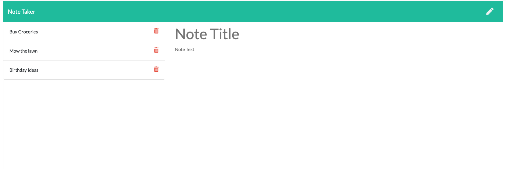

# Note Taker

## Description

The purpose of this application is for someone to easily create notes, with the ability to view and delete existing note entries.

I used the following npm packages to built this application:
* Express
* uuid

## Details

* By clicking Get Started on the home screen, you're taken to the Notes page.
* You begin by typing the note title and body. Once both fields contain text, the save icon in the top-right will appear.
* When you save your note, it appears in the left-hand column where you can eithe click it to see the note body, or delete it.

## Live App

You can view the live application [here](https://immense-reaches-36582.herokuapp.com/).

